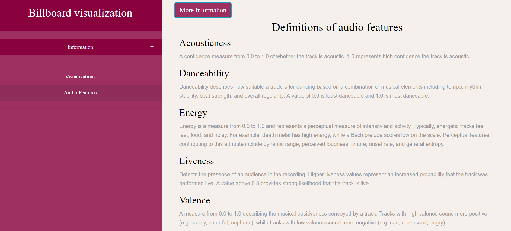

# DataProject: Analyzing 50 years of Billboard's Hot 100 Charts :musical_note:

## Description

The tool analyzes data from the Billboard Hot 100 through the years, in combination with Spotify's audio features.
You can inspect the [data](https://data.world/kcmillersean/billboard-hot-100-1958-2017) on micro level by looking at the songs themselves. At the same time, you will be able to get a macro perspective on this analysis by looking at the trends over time, surpassing the boundaries of just one era by looking at the music industry history as a whole.
It shows that more and more popular music is focused on high energy levels and increasing danceability. This corresponds with the increase of rap and dance music. Click [here](https://anonymeoww.github.io/DataProject/) to visit the page.

## Demo

  

## Features

This tool has the following features:
* A ``Bubble Chart`` that shows the danceability and energy of all unique songs that peaked the Hot 100 in one year. Every bubble represents one song.
* The bubbles are **coloured** according to their genre.
* Selecting specific genres with ``Checkboxes`` will filter the Bubble Chart, and show only songs for the selected genres.
* Selecting the year from a ``Dropdown Menu`` will update the Bubble Chart and show all songs from the selected year.
* Selecting a song on the Bubble Chart by **clicking** it will update the Multiline Graph and Radar Chart.
* The ``Multiline Graph`` shows different lines. The lines represent all songs from the corresponding artist that were in the Hot 100 Chart in the selected year. The graph shows the position that the songs had in the Hot 100, per week.
* The ``Radar Chart`` shows the same data as the Multiline Graph. The different variables (acousticness, danceability, energy, liveness and valence) for the songs are shown on the different axes.
* It is possible to **toggle** the side menu, so it opens and closes.
* It is possible to **toggle** the information panel in the side menu, it provides extra information about the page.
* The tool functions excellent on mobile devices.
* There is an extra page that provides information on the audio features.

## External Sources
All external sources can be found under `modules`, except for the original HotStuff.csv file under `assets`.
* [D3 version 3](https://d3js.org/)
* [D3 version 5](https://d3js.org/)
* [D3 tooltip](https://github.com/caged/d3-tip)
* [RadarChart module](http://bl.ocks.org/nbremer/21746a9668ffdf6d8242)

## MIT License
For all files except external sources:
Copyright &copy; 2019, Dilisha C. Jethoe
