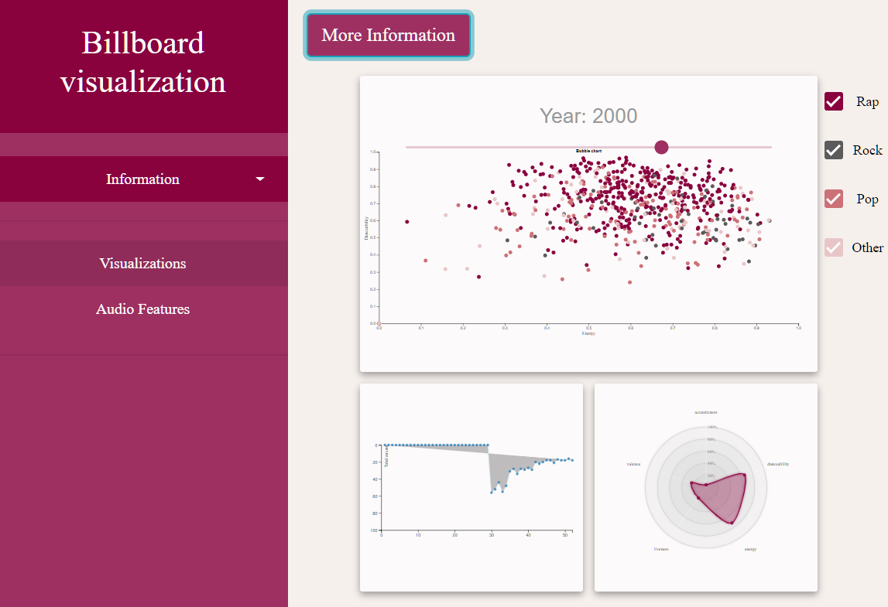

# MPROG DataProject 2019
### Dilisha C. Jethoe (12523186)

The visualization analyzes data from the Billboard Hot 100 through the years, in combination with Spotify's audio features. It shows a Bubble Chart with all the songs that peaked the charts in one year, a Multiline Graph that shows the position in the Hot 100 of all songs of one artist, and a Radar Chart that displays the audio features of the same songs as the Multiline Graph. Click [here](https://anonymeoww.github.io/DataProject/) to visit the page.

## Technical Design

The visualization has three visuals:
* The `Bubble Chart`. It shows all the songs that peaked the charts in one year, mapped against the audio features Danceability (y-axis) and Energy (x-axis). Every bubble represents one song. The color of each bubble shows the genre of the song, and can be found in the legend on the right side. The legend itself functions as a filter. By checking the checkboxes, the user can filter the Bubble Chart for specific genres that they are interested in. The slider at the top of the chart can be used to change to a different year, and thus see different songs. By default, the data from 2018 will be displayed, as it is the most recent data. Clicking a bubble will display the title and artist of the corresponding song. It will also cause the Multiline Graph and Radar Chart to update.
* The `Multiline Graph` shows the position of all the songs of the selected artist from the selected year. Hovering over the area below a line shows a tooltip with the name of the song. Hovering over a circle on the line displays a tooltip with the position of the song.  
For example: the user is looking at data from 1997 and selects the song 'Hole in my Soul' by Aerosmith. The graph will show two lines, one for 'Hole in my Soul' and 'Falling in Love (Is Hard on the Knees)', because these two Aerosmith songs peaked the charts in 1997. By default, the data from the first artist in the selected year will be shown.
* The `Radar Chart` has five axes, for five different audio features: acousticness, danceability, energy, liveness and energy. Every figure represents a song and has a different color. Hovering over a circle on an axis shows a tooltip with the exact value of the audio feature. By default, the data from the first artist in the selected year will be shown.

The JavaScript files used for this project are the following:

|          Filename: | Description:                                                                                                                                                                                                                                                                                                                                                                                                                                                                                                                                                                                                                                                                                                                                                                                                                                                                                 |
|-------------------:|----------------------------------------------------------------------------------------------------------------------------------------------------------------------------------------------------------------------------------------------------------------------------------------------------------------------------------------------------------------------------------------------------------------------------------------------------------------------------------------------------------------------------------------------------------------------------------------------------------------------------------------------------------------------------------------------------------------------------------------------------------------------------------------------------------------------------------------------------------------------------------------------|
| ``bubblechart.js`` | This file has one main function, which loads the data and updates the data when the slider is being used. In the function, there is a subfunction that sets the dimensions and creates the Bubble Chart the event listeners for the checkboxes are also called here. The other subfunction updates the Bubble Chart with  new input. There is a function that selects the correct subset of data, that is being called everytime the year-slider changes. This subset of data is an argument taken by the update function. There is a function that gets triggered when a circle is being clicked. It creates an array of indexes where all songs from the selected artist occur. This function also triggers the update functions for the other two visuals. The last function is being called when a checkbox is getting (un)checked and makes songs from the selected genre (in)visible.  |
|   ``multiline.js`` | This file has one main function, which loads the data. In the function, there is a subfunction that sets the dimensions and creates the graph. The file also contains an update function that gets called in bubblechart.js                                                                                                                                                                                                                                                                                                                                                                                                                                                                                                                                                                                                                                                                  |
|       ``radar.js`` | This file has one main function, which loads the data. In the function, there is a subfunction that sets the dimensions and creates the Radar Chart. The file also contains an update function that gets called in bubblechart.js                                                                                                                                                                                                                                                                                                                                                                                                                                                                                                                                                                                                                                                            |
|  ``radarchart.js`` | This file is a module that is being called in radar.js. It creates aesthetically pleasing radar charts and is designed by Nadieh Bremer.                                                                                                                                                                                                                                                                                                                                                                                                                                                                                                                                                                                                                                                                                                                                                     |
| ``layout.js``      | This file contains a jQuery script that toggles the menu on the left.                                                                                                                                                                                                                                                                                                                                                                                                                                                                                                                                                                                                                                                                                                                                                                                                                        |
| ``scrollbar.js``   | This file contains a jQuery script that creates a scrollbar for the menu on the left. I ended up not using it, because I changed the width of the menu itself.                                                                                                                                                                                                                                                                                                                                                                                                                                                                                                                                                                                                                                                                                                                               |

I also used the following files:
* `index.html` and `audiofeatures.html` for creating the website.
* ``hotstuffwgenres.json`` and ``positions.JSON`` contain the used data.
* `d3-tip.js` and `d3.js` for using d3.
* ``hotstuff.css`` for styling the webpages.

## Challenges during development:
I underestimated the time it would take to create usable JSON files. While working on my visualizations I found myself realizing I needed a different structure on two different occasions. This meant that I had to rewrite my python code and run my program for a few hours on two different days, as my dataset consists of 131.296 unique entries.  
I did not foresee the problem of having many songs that have multiple artists. This gave problems in working with Spotify's API and later on in combining data from the two JSON files. Had I known this, I would have constructed the second JSON file with the positions in a different manner.  
I do not regret choosing a radar chart, because I think it works very well with my type of data. But I did find it very difficult to find proper documentation on the creation of such graphs. That is the reason I ended up using a module. I love the design, but because I did not write it myself, I could not find a proper way to display the tooltip, and I think that's a shame.

## Reflection
I am really happy with my visualization. I put a lot of effort into the design and scaling, because I feel that it is very important for users to appreciate the looks and feel of the tool.  
Looking back on my [proposal](PROPOSAL.md) and [process](assets/PROCESS.md), I think I achieved most of my goals. I have learned a lot and if it wasn't for the time constraints, I am positive I would have been able to implement my optional features as well. The biggest change was actually the layout of the page, because I found that I needed to use the full width for the Bubble Chart. My initial design also meant not having to scroll on the page, so you can see the link between the visuals more directly. This was unfortunately impossible with the current method of scaling, but the scaling works perfectly, so I guess that that's a trade off.  
If I had more time, I don't think I would change anything except for not having to scroll inside the page. I would just add more functionality, like my optional features and better tooltips. I would also have loved to make a search bar, so the user could easily find songs from their favorite artists and highlight them for example.
